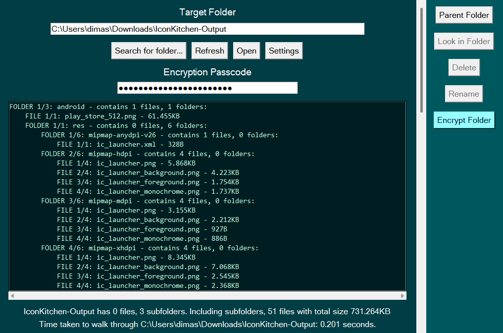
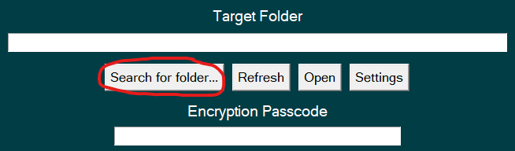
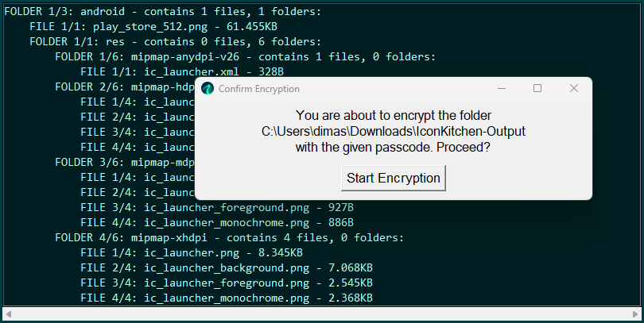
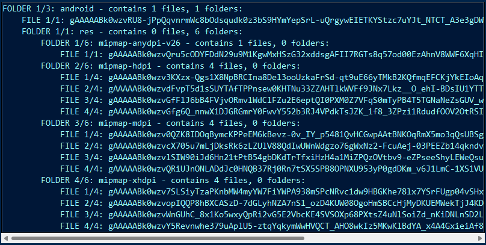
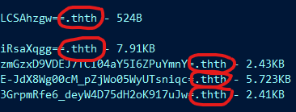
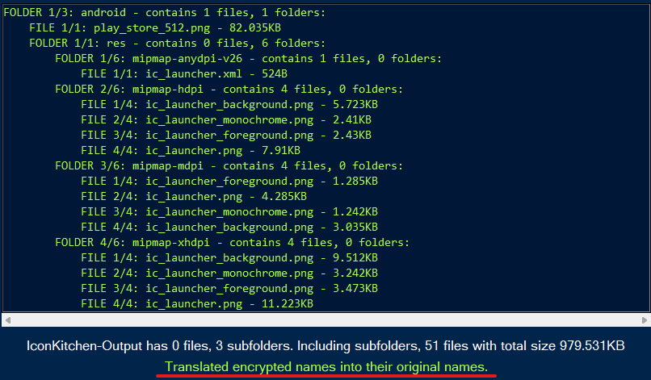
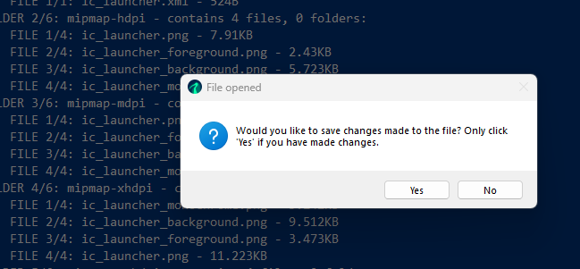
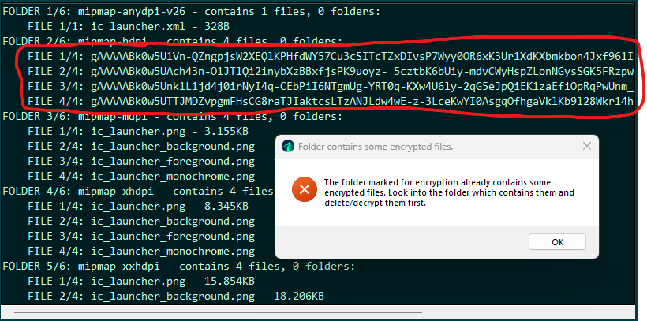

<p align="center">
  
<p align="center">

# Named after the Egyptian god of sacred texts, ThothCrypt isn't far from mythology...

### ThothCrypt is a simple graphical program to encrypt entire folders just by using a single passcode, made in Python. Fernet encryption from the cryptography package is used for symmetric encryption and Tkinter is used to handle the GUI. Here's the main menu:

<p align="center">
  
<p align="center">

### This project is currently in active development, and I am still seeking out bugs. ThothCrypt is a dangerous tool if mishandled. I am not resposible for any loss of data, and hence I am reminding the reader to practice safe file management. Please at least read [Getting Started](#getting-started) before you start using this program. Do not forget important passcodes and know your folder locations!

### 1. [Getting Started](#getting-started)
### 2. [Common Errors](#common-errors)
### 3. [Downsides to Encryption](#caveats)
### 4. [More Features](#more-features)
### 5. [How It Works](#how-it-works)

## Getting Started

### Target Directories

Upon opening the app, two text fields can be seen at the top. One for the Target Folder, and one for the chosen passcode. The first step is to choose a folder to encrypt. You could manually type out the path to your directory, but I'd imagine most people would click on `Search for folder...` which brings up a file explorer to select the folder graphically.

<p align="center">
  
<p align="center">

Sidenote: 'directory' and 'folder' are used interchangeably here.

### Folder content box

Once the target directory is selected, the gigantic list box below the two text fields will now be populated with the folder's contents. As with most folders, there are folders within folders within other folders... so how do we know which files or folders go where?

Whenever an item (file or folder) title is indented by 4 spaces, this means that this item is included in the above folder that is unindented, much like functions or loops in Python programming:

```
FOLDER 1/1: myfolder - contains 3 files, 1 folders:
    FILE 1/3: insideMyFolder.txt - 7KB
    FILE 2/3: insideMyFolder2.txt - 4KB
    FOLDER 1/1: nestedFolder - contains 1 files, 0 folders:
        FILE 1/1: insideNestedFolder.txt - 1.3KB 
    FILE 3/3: insideMyFolderAgain.txt - 7KB
```

The result is an efficient way to display nested folder contents - every item in the list box is either a file or a folder.

### Encryption

Once we are sure that the target folder is the folder we want to encrypt, we can start thinking of a passcode and typing it on the `Encryption Passcode` text field. As always, more secure passcodes have a mixture of numbers, upper and lowercase letters and symbols. However, in Thoth, password choices are not restricted. Any non-blank passcode can be used.

<p align="center">
  
<p align="center">

Once a passcode is entered, we can click on `Encrypt Folder` and begin encrypting the entire folder. It is that simple! EVERY file in the folder will be encrypted, even those within subfolders. The names of the subfolders remain the same though.

<p align="center">
  
<p align="center">

### Visual Differentiation

Once all files within the folder are encrypted, the app turns from <b>green to blue</b>. The color difference is to differentiate normal folders and encrypted folders: app turns <b>green</b> if target folder is unencrypted and turns <b>blue</b> if target folder is encrypted.

<p align="center">
  
<p align="center">

If we open the encrypted folder using the file explorer, we see that all of the filenames have turned into strings of random characters, appended with a .thth file extension. 

<p align="center">
  
<p align="center">

The encrypted folder also contains a small additional .ththscrpt file to mark it as encrypted, but it does not show up in ThothCrypt. <b>DO NOT</b> delete this file or modify any of the encrypted files, as <b>any slight changes might render the encrypted files completely unrecoverable.</b> 

### Decryption

If you want the folder back, you can follow the same steps as before, type in the same passcode that you used to encrypt the folder, then click on the `Decrypt Folder` button, and the entire target folder will be back to normal, untouched.

### Decrypting only one file and running it

If you have an encrypted folder, but you only need to <u>gain access to a <b>single</b> file,</u> you can click on the `Translate` button, which will translate all of the encrypted filenames to their original names. You can now double click on one of the files, which would encrypt and run <u>ONLY</u> the file you selected and ignoring the rest, saving time.

<p align="center">
  
<p align="center">

### Saving Changes to an Encrypted File

After gaining access to a single file like we mentioned earlier, you might want to make some changes and save them, such as adding paragraphs to a word document, editing photos... etc. In this case, in addition to saving progress inside the file itself, ThothCrypt will open a window to ask if you want to save your changes, and you <b>must</b> click on `Yes`. This is because for time-saving and memory fragility concerns, ThothCrypt <b>DOES NOT</b> automatically save changes to your file as it requires re-encryption and re-writing. For more info, visit <b>[How It Works](#how-it-works)</b>.

<p align="center">
  
<p align="center">

### Adding files into an encrypted folder
If you want to add unencrypted files into an encrypted folder, simply click on `Add Files` then select the unencrypted files. ThothCrypt will automatically encrypt those files and place them in the target folder. No need to decrypt everything, manually move the files and encrypt everything again. 

## Common Errors
<b>Wrong passcode:</b> The passcode you typed was not the same as the passcode used to encrypt the folder. When encrypting, always remember the passcode used to do so. Note that this error only arises whenever decryption is necessary, e.g. Folder Decryption, Translation, Renaming of Encrypted Files, Opening Encrypted Files...

<b>Folder already contains some encrypted/decrypted files:</b> The `Encrypt Folder`, `Decrypt Folder` and `Translate` buttons only work if EVERY file in the target folder is unencrypted or encrypted respectively. It does not work if the target folder is supposed to be encrypted, but contains some decrypted files or vice versa. For reference, an encrypted file is a file that has a string of random characters as names, followed by a `.thth` extension, and a folder that is supposed to be encrypted contains a file with the name of the folder as its name, followed by a `.ththscrpt` extension.

<p align="center">
  
<p align="center">

## Encryption Caveats

There are some drawbacks to consider with file encryption:

### Slow speed
Encryption isn't just opening and running a file - it scrambles the file contents reversibly according to a 32-bit key, a very complex process that can take up to minutes when a folder contains very large files.

### Size Bloat
Using Python's Fernet encryption, the size of the file contents increase by about 33.3%, this is because for every 3 bits of input, the encryption function spits out 4. I have ideas to implement a file compression algorithm but compression is likely to be ineffective due to the randomness of the contents, and it makes the entire process significantly slower if implemented.

### Memory Wear and Tear
The encryption process requires reading every single file in a folder, encrypting their contents, and writing all of those contents back into the same file locations. This may be a problem when using fragile memory mediums such as very old hard drives or SD Cards, as they may have slow or limited read/write cycles.

## More Features

### Rename File
The `Rename` button renames files. 

### Running a File
Upon selection of a file, you can double click it to run the file, just like you would on a file explorer. Double-clicking on a folder opens the folder in a file explorer. Right-clicking each item displays the full path of the object selected.

### Open Button
The `Open` button opens the target folder in your file explorer.

### Deleting a File
Click the `Delete` button to remove a file. It can also remove entire folders and all of its contents.

### Look In Folder
Click on a folder and click this button to change the target folder to the selected folder.

### Add File
Appears only when target folder is already encrypted, this button automatically brings up a file explorer to let you select files, which will be automatically be encrypted and moved to the target folder.

### Translate Button
Appearing only when the target folder is encrypted, this button translates the gibberish of the encrypted filenames into its original names. A passcode is required for this. In the translated mode, the filenames turn from blue to green. In this mode, you can rename or open the files as per normal. However, if you opened the file and have made changes to the file you want saved, you MUST click 'Yes' on the dialog box that shows up after the file is opened, as pointed out earlier.

### Forbidden Extensions - in Settings
Create a list of file extensions that ThothCrypt will ignore when encrypting or decrypting.

### Passcode Generator - in Settings
Generates a secure 32-character passcode for you that includes lowercase/uppercase characters, numbers and symbols. It even has a function to save it as a `.txt` file onto your desktop.

## How it works

### File Browsing
When the target folder is selected it lists out all the files within this folder using the following recursive function that takes in either a File or a Folder:
```python
def fileList(direct:Directory): #root Directory
    files = list()
    for item in direct.contents: #item can either be File or Directory
        itemPath = joinAddr(direct.path, item.name) #Path of this item
        if not isAllowed(itemPath):
            continue 
        if isFile(itemPath):
            files.append(itemPath) #add the filepath to the Files list
        else:
            recursed = fileList(item)
            files.extend(recursed)
    return files
```
In the aforementioned function, when the folder system is seen as a tree data structure with Files and Folders as nodes, the function traverses each branch, and backtracks to the last Folder when it sees a File. It stores the full path of every node on this tree. This process is called 'walking' through or looking through the folder, and could take some time depending on the number of files in the folder.

### Modification using Fernet
'Modifying' in this context refers to either encrypting or decrypting. ThothCrypt uses Fernet encryption, included in the Python cryptography library. Fernet uses a 32-byte key, to modify content. Anyone who has this key would be able to decrypt your encrypted files and read them.

Since most of us are not expected to memorize a 32-byte (32 characters) passcode, ThothCrypt uses a hash function (SHA-256) that transforms any string into the 32-byte key that Fernet desires. This allows a more friendlier range of passcodes.

A hash function is a function that takes in an input string of any length and spits out a fixed length string. For example, the hash function used is SHA-256, which spits out a nearly unique 256-bit (32 bytes) string for any string input.

`passcode -> hashfunction() -> key used for modification`

Hash functions are irreversible, so it is near impossible to trace the input string of the hash function, just by knowing the hash result. It is important to know that if very simple input strings are used, it is possible to bruteforce hash results given enough time. Hence, it is advised to choose a complex passcode, though we do not try to limit you here.

### Password Checking
Folders can be encrypted and decrypted by using a single passcode and hashing the passcode into a usable key. However, Fernet does not have a built-in key checking function, which leads to problems if you misstype the passcode, leading to multiple keys and undesired behaviour:
```python
#what's supposed to happen:
            key1                        key1
normalFile -encryption-> encryptedFile -decryption-> normalFile
```
```python
#what can happen if multiple passcodes are used to modify the same file:
            key1                        key2
normalFile -encryption-> encryptedFile -decryption-> undefinedFile
```
Hence we need to check that the passcode used for decryption is the same key used for encryption. We cannot store this passcode in the folder, or even in the PC Folders, as that would be a security risk. Hash functions come in handy here as well. During encryption, we hash the encryption key, then write it into a `.ththscrpt` file which will be placed inside the encryption folder. This way, when we decrypt, we shall check the hash of the key given for decryption against the hash inside of the `.ththscrpt` file, if both hashes are the same, this means that the key is the same as the key used for encryption, and decryption can proceed safely.

### File Modification Methods 
When a folder begins modification, it loops through every single filepath stored earlier from walking through the file, and reads each of the files contents. For each file, it feeds the file contents into the Fernet encryption function mentioned earlier in order to write back the encrypted contents into the same file: 

```python
#read data from this filepath
with open(filePath, 'rb') as file:
    data = file.read()
#modify the data
if isEncrypting:
    modified = Fernet(key).encrypt(data)
else:
    modified = Fernet(key).decrypt(data)
#then write back to it.
with open(filePath, 'wb') as encrypted_file:
    encrypted_file.write(modified)
```

The filename has to be encrypted as well, as filenames could reveal the contents of the file. The filename is encrypted using the same process, but when encrypting, we add the `.thth` extension to mark the file as encrypted by ThothCrypt.

```python
oldFileName = filePath.split(sep='\\')[-1]
newFileName = None
if isEncrypting:
    #!if encrypting, add the .thth extension before renaming
    newFileName = Fernet(key).encrypt(oldFileName.encode()).decode() + ".thth"
else:
    #!if decrypting... remove the .thth extension first before reverting to original filename.
    newFileName = Fernet(key).decrypt(oldFileName.removesuffix(".thth").encode()).decode()
newPath = oldFilePath.replace(oldFileName, newFileName)
#rename the file.
os.rename(oldFilePath, newPath)
```
An issue with this file encryption method is that due to the line `data = file.read()`, ALL of the file data is exepected to be stored in memory, within the variable `data`. While this is okay for small files, huge files such as those more than 1GB, would sometimes be infeasible to store in memory, leading to encryption issues due to incomplete data in memory. This led to a chunk-by-chunk approach introduced in ThothCrypt 1.1:

### Improved modification method
The improved method for modification involves creating an empty file with the modified name first, then reading one chunk of data from the original file, encrypting only that chunk, then appending the modified chunk to the modified file. This repeats for every 256KB chunk that the original file takes up. Once all the chunks are encrypted and appended to the modified file, the original file can be deleted.

```python
CHUNKSIZE = 1024*256
ENCRCHUNKSIZE = 349624

#forming the modified file name and path
if isEncrypting:
    name = Fernet(key).encrypt(oldFileName.encode()).decode()
    newFileName = name + ".thth"
else:
    newFileName = Fernet(key).decrypt(oldFileName.removesuffix(".thth").encode()).decode()
newFilePath = destinationFolder + "\\" + newFileName

#create the new file, then modify chunk-by-chunk
with open(filePath, 'rb') as oldFile, open(newFilePath, 'ab') as newFile:
    while True:
        if isEncrypting:
            chunk = oldFile.read(CHUNKSIZE) 
            if not chunk:
                break
            else:
                modified = Fernet(key).encrypt(chunk)
                newFile.write(modified)
        else:
            chunk = oldFile.read(ENCRCHUNKSIZE)
            if not chunk:
                break
            else:
                modified = Fernet(key).decrypt(chunk)
                newFile.write(modified)

#delete the original file.
os.remove(filePath)
```

This method is slightly slower as it needs to seperate the contents of the original file into 256KB chunks and encrypting and writing it one-by-one. It is also storage-intensive, because at one point during encryption, you have 2 files that represent the same data simultaneously: the original file and the modified file. Only after modification will the original file be deleted. However, this enables larger files to be encrypted, such as videos and games, and also provides a smoother progress bar, as each modification session only works with a fixed size: 256KB for encryption and 349624B for decryption.

### Single file decryption: a hardware consideration
In a folder of encrypted files, sometimes we only need just one. It would not be feasible to decrypt an entire folder just to acccess one file as it would be too time-consuming. Hence, we have a dedicated process that optimises exactly that, by writing into the encrypted folder only when necessary.

Usually, when files are modified, we read the file contents, modify it, then write it into the <b>SAME</b> file. However, to cut down on time, single file decryption <b>TRIES</b> not to write it back into the same file, but instead writes it into a temporary file within a folder in the computer, where it can be written fast. Ofcourse, this only makes a difference if the encrypted folder is stored in a slow drive, such as SD Cards or old HDD's, as it prevents writing into the said drive, only reading it. Once ThothCypt writes it into the folder in the PC, it can then run the file for the user. 

ThothCrypt will then prompt the user if they want to save any changes made into the file. If the user chooses not to, ThothCrypt simply disposes of the temporary file. Only if the user chooses to save, ThothCrypt will re-encrypt the temporary file then save it into the encrypted folder.